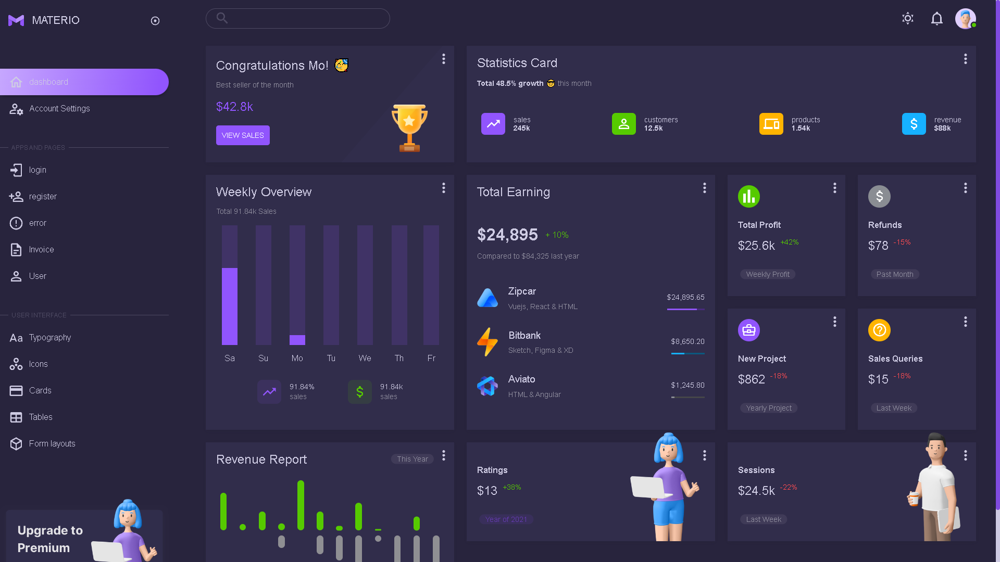

<div id="top"></div>


<!-- PROJECT LOGO -->
<div align="center">
  <h2>Dashboard React App</h2>
</div>

<br>
<br>
<br>
<br>

<!-- TABLE OF CONTENTS -->
  <summary>Table of Contents</summary>
  <ol>
    <li><a href="#overview">Overview</a></li>
    <li><a href="#stack">Stack</a></li>
    <li><a href="#getting-started">Getting Started</a></li>
    <li><a href="#installation">Installation</a></li>
    <li><a href="#demo">Live Demo</a></li>
    <li><a href="#screenshots">Screenshots</a></li>
  </ol>

<br>
<br>
<br>

<!-- ABOUT THE PROJECT -->

## Overview

### This is a Dashboard which used a lot of react functionality to create. Has Main, login, Register, Error Pages

## Stack

- React.js
- Redux
- portals
- react-transition-group

---

<!-- GETTING STARTED -->

## Getting Started

This project require some prequesites and dependenscies to be installed, you can find the instructions below

> To get Started, follow these simple steps :

## Installation

1. Clone the repo

2. go to project folder

3. install dependencies

   ```bash
   npm i
   npm start
   ```

<br>
<br>

## Screenshots

### Preview Image



## Preview

[](https://react-foodorder-cart.netlify.app/)

## Trial Credentials

email: mo@cs.mo
password: 12345678

<p align="right">(<a href="#top">back to top</a>)</p>
